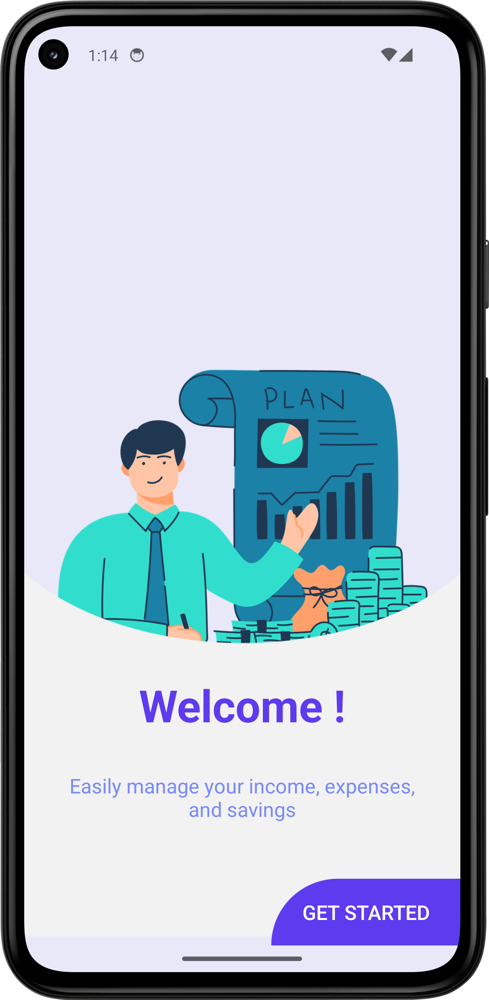
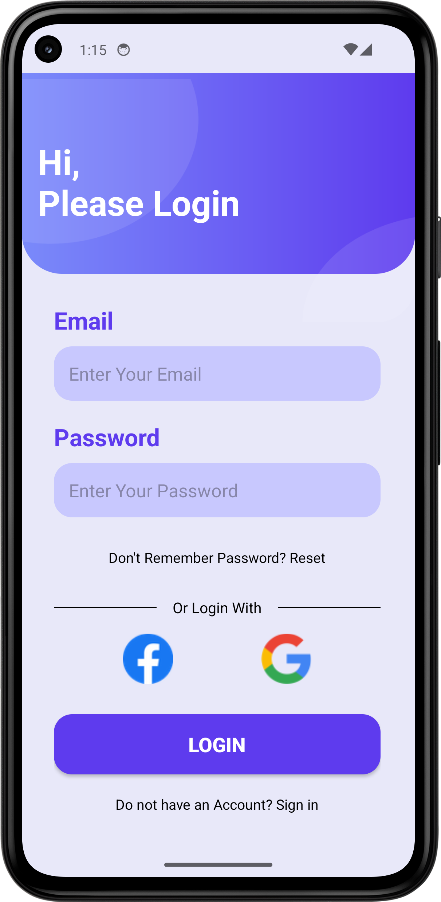
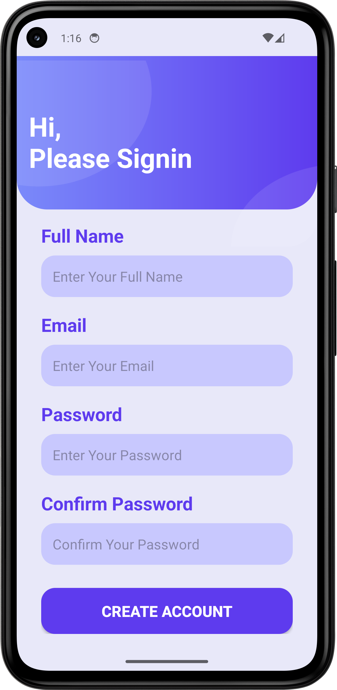
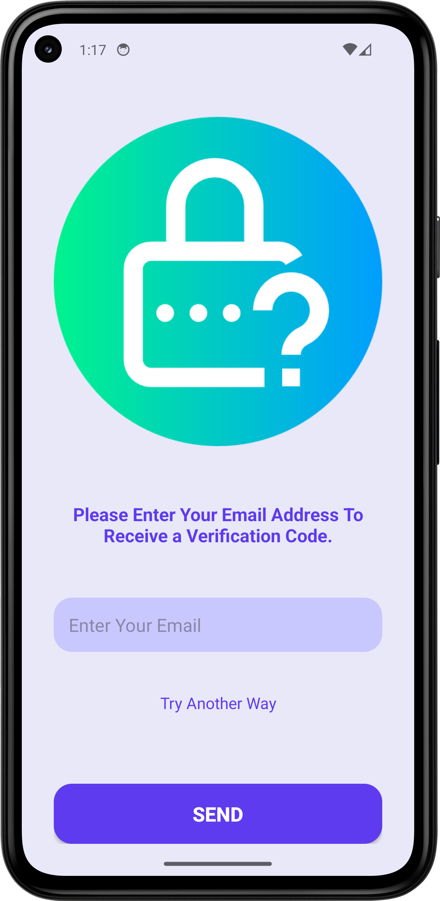
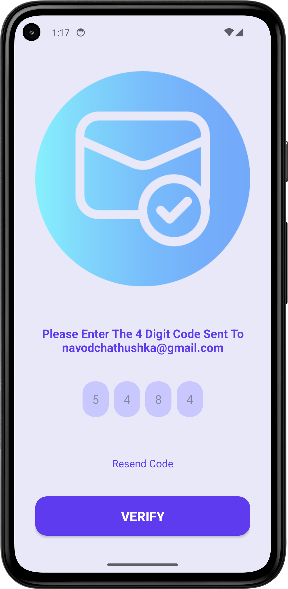
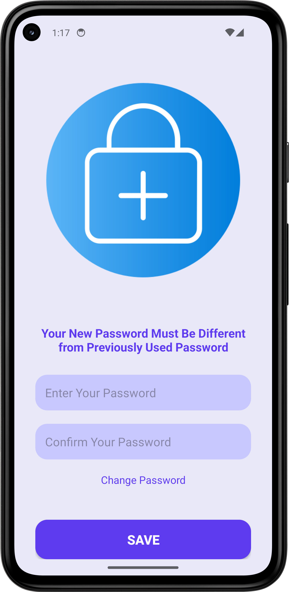
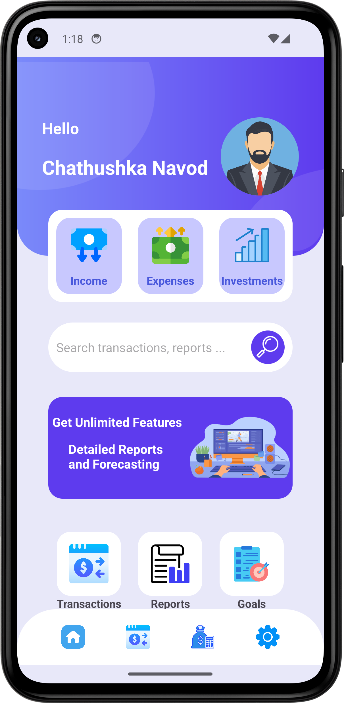
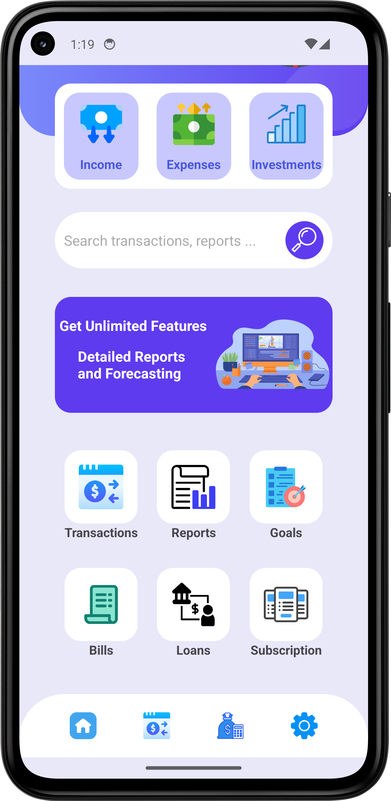
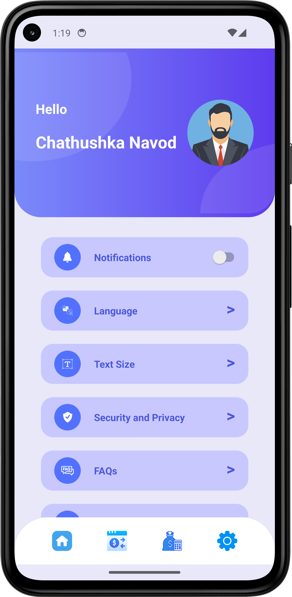
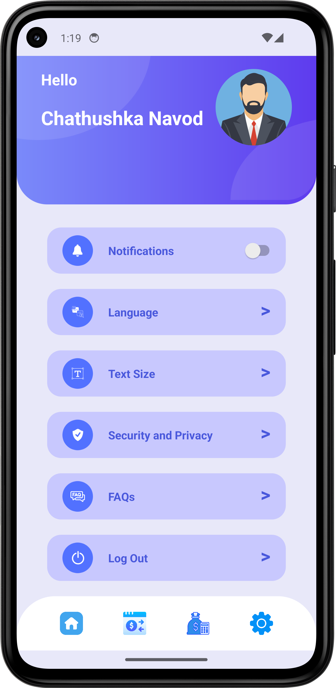

# 📱 Solo Trekkers - Your Ultimate Personal Expense Tracker 🚀

Solo Trekkers is a modern personal expense tracking app designed as part of the UI/UX component for the second exam of the Mobile Application Development Module in Year 2, Semester 2. This project showcases an engaging and intuitive interface that makes managing your finances effortless and enjoyable.

### ✨ Key Highlights
- **Elegant Design**: A user-friendly interface with a clean, modern look to simplify your expense tracking.
- **Intuitive Navigation**: Smooth transitions and easy-to-use features that make budgeting feel less like a chore.
- **Personalized Experience**: Tailored features to help you keep track of your spending habits in style.

Whether planning your next big trip or managing daily expenses, Solo Trekkers is here to help you take control of your finances with style and ease. Let Solo Trekkers be your companion on the journey to better financial management! 🌟

  
  

  
  

  
  

  
  

  
  

